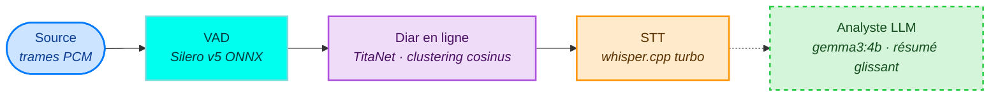
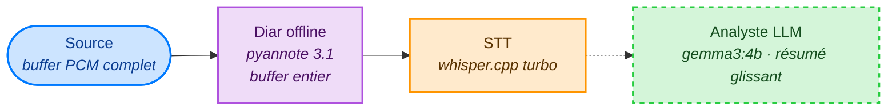

# Vocal Helper

[🇫🇷](LISEZMOI.md) · [🇬🇧](README.md)

[](https://github.com/warith-harchaoui/vocal-helper/actions/workflows/ci.yml)
[](LICENSE)
[](#)
[](https://github.com/astral-sh/ruff)
[](.github/PULL_REQUEST_TEMPLATE.md)

`Vocal Helper` fait partie de la collection `AI Helpers` — des bibliothèques Python pensées pour bâtir des outils d'intelligence artificielle.

[🌍 AI Helpers](https://harchaoui.org/warith/ai-helpers)

Vocal Helper est un **pipeline producteur/consommateur asynchrone** qui transforme un flux audio PCM en direct en énoncés diarizés et transcrits — et, en option, en résumé glissant produit par un LLM.

## Pipeline

Toutes les frontières entre étages sont des `asyncio.Queue` bornées ;
chaque étage est sa propre coroutine. Les couleurs suivent la
[palette AI Helpers](https://harchaoui.org/warith/colors/).

### Online (streaming)



L'arête pointillée indique que l'analyste LLM est optionnel
(`llm=None` le désactive).

### Offline (batch)



Pas de VAD dans le chemin offline — la diarisation absorbe le buffer
complet et fait sa propre segmentation.

| Étage | Modèle | Notes |
|---|---|---|
| **VAD** | Silero v5 ONNX (CPU) | Fenêtre 32 ms, `activity_threshold=0.5`, `min_silence_ms=300` par défaut. |
| **Diarisation (online)** | `pyannote/embedding` (défaut) ou `nvidia/titanet_large` (NeMo) | Embedding par segment + clustering moyenne-mobile par distance cosinus, `join_threshold=0.30`. Calibré sur AMI dev-slice N=8 (2026-06-30). |
| **STT** | [`pywhispercpp`](https://github.com/abdeladim-s/pywhispercpp) turbo | `large-v3-turbo-q5_0` par défaut, timestamps mots activés. Exécution en thread pool pour ne jamais bloquer la boucle async. |
| **Analyste LLM** *(optionnel)* | Gemma 4 e4b servi par Ollama (`gemma4:e4b`) | Résumé glissant de tout ce qui est **plus vieux que 60 s**. La fenêtre récente de 60 s reste verbatim. La variante `-mlx` est auto-sélectionnée par Ollama sur Apple-Silicon. |

## Démarrage rapide

> **Déploiement sur un serveur GPU ?** Voir [TECHNICAL_STACK.md](TECHNICAL_STACK.md)
> pour la recette complète : CUDA + PyTorch, whisper.cpp compilé avec
> `GGML_CUDA=on`, pyannote 3.1 sur MPS/CUDA, service systemd Ollama,
> template Docker Compose, RTF attendus par GPU, et un manifest
> d'installation reproductible en 10 étapes couvrant toute la suite
> AI Helpers (os-helper, audio-helper, podcast-helper, youtube-helper,
> vocal-helper, music-helper).

### Installation

**Prérequis** — **Python 3.10–3.13** et **git**, **ffmpeg**, **PortAudio**, multiplateforme :

- 🍎 **macOS** ([Homebrew](https://brew.sh)) : `brew install python git ffmpeg portaudio`
- 🐧 **Ubuntu/Debian** : `sudo apt update && sudo apt install -y python3 python3-pip git ffmpeg portaudio19-dev`
- 🪟 **Windows** (PowerShell) : `winget install Python.Python.3.12 Git.Git Gyan.FFmpeg` (PortAudio est inclus dans les wheels Python)

Puis installer le paquet :


```bash
pip install 'vocal-helper[all]'
```

L'extra `[all]` installe la source micro, pyannote et Ollama. À la carte si tout n'est pas nécessaire :

| Extra | Apporte | Requis si |
|---|---|---|
| (aucun) | `pywhispercpp`, `silero-vad`, `audio-helper` | Sources fichier / numpy, sans diarisation |
| `[mic]` | `capture-helper` | Entrée microphone live |
| `[pyannote]` | `pyannote.audio` | `diar={'backend': 'pyannote'}` (défaut) |
| `[nemo]` | `torch`, `nemo-toolkit[asr]` | `diar={'backend': 'nemo'}` |
| `[llm]` | `ollama` | `llm={'model': 'gemma4:e4b'}` |
| `[all]` | Tout ce qui précède | Installation en une ligne |

[Ollama](https://ollama.com) doit également tourner en local si l'analyste LLM est activé :

```bash
ollama pull gemma4:e4b
ollama serve
```

### Poids des modèles — aucun HuggingFace requis

Tous les poids sont fournis dans un **bundle diarization-engines**
auto-hébergé (pyannote 3.1 offline, NeMo Sortformer, l'embedder online
`pyannote/embedding`, SpeechBrain VoxLingua107). On pointe `vocal-helper`
dessus une fois et toute la chaîne tourne **sans HuggingFace** — aucun
token, aucun téléchargement gated, compatible `HF_HUB_OFFLINE=1`.

La configuration tient dans `settings.yaml` (seule config nécessaire) :

```bash
cp settings.yaml.example settings.yaml
# settings.yaml contient déjà :
#   engines:
#     diarization_url: https://deraison.ai/diarization-engines.zip
# settings.yaml est gitignoré.
```

L'URL du bundle est téléchargée une fois puis mise en cache sous
`~/.cache/vocal-helper` ; vous pouvez aussi pointer
`$VH_DIARIZATION_ENGINES` vers un dossier local. TitaNet (embedder online
par défaut) se charge depuis NVIDIA NGC, sans HuggingFace non plus.

### Micro live → terminal

```bash
# Aucun token, aucun HuggingFace — les poids viennent du bundle diarization-engines.
vocal-helper mic --llm
```

### API Python

```python
import asyncio
import vocal_helper as voh

async def main():
    pipeline = voh.Pipeline(
        source=lambda: voh.sources.from_microphone(),
        config=voh.PipelineConfig(
            diar={"backend": "pyannote"},
            asr={"model": "large-v3-turbo-q5_0", "language": "fr"},
            llm={"model": "gemma4:e4b"},   # retirer pour désactiver
        ),
    )
    async for ev in pipeline.run():
        if "text" in ev:
            print(f"[{ev['t0']:.1f} {ev['speaker']}] {ev['text']}")
        elif "summary" in ev:
            print(f"--- résumé glissant ---\n{ev['summary']}")

asyncio.run(main())
```

### Rejouer un WAV à travers le pipeline

```bash
vocal-helper file chemin/vers/conversation.wav --llm
```

La source fichier respecte le tempo réel par défaut ; `--no-real-time` accélère le traitement (mode batch).

## Exposition multi-surface

`vocal-helper` expose la même pipeline via quatre surfaces cohérentes : un script shell, un script Python, un conteneur derrière un reverse proxy, ou un agent compatible MCP — sans re-câbler la logique ailleurs.

| Surface | Point d'entrée | Extra | Usage |
|---|---|---|---|
| CLI argparse | `vocal-helper` | (aucun — livré avec l'install de base) | Scripts shell, cron, CI headless, redirection vers `jq`. |
| CLI click | `vocal-helper-click` | `[cli]` | `--help` riche, complétion shell, sous-commandes chaînées. |
| HTTP FastAPI | `uvicorn vocal_helper.api:app` | `[api]` | Derrière un reverse proxy — upload d'un fichier, réponse transcription/événements, `GET /docs` pour l'OpenAPI. |
| Outils MCP | `vocal-helper-mcp` | `[api,mcp]` | N'importe quel hôte compatible MCP — runtimes d'agent, intégrations IDE — publie `transcribe` et `pipeline` comme outils natifs. |

```bash
# argparse
vocal-helper transcribe clip.wav --language fr
vocal-helper file reunion.wav --offline --language fr --llm

# jumeau click
vocal-helper-click transcribe clip.wav --language fr

# surface HTTP
uvicorn vocal_helper.api:app --host 0.0.0.0 --port 8000 &
curl -F 'file=@clip.wav' -F 'language=fr' http://localhost:8000/transcribe
curl -F 'file=@reunion.wav' -F 'llm=true' http://localhost:8000/pipeline

# surface MCP (même app FastAPI + endpoint /mcp monté)
vocal-helper-mcp
```

Une recette Docker en une ligne est livrée dans `Dockerfile` — `docker build -t vocal-helper .` produit une image servant HTTP + MCP sur `:8000`. Voir `GUI.md` pour le plan (WIP) du produit visuel.

## Abonnés — fan-out sans posséder la boucle

Chaque étage peut être observé sans consommer le flux fusionné :

```python
async def on_voiced(seg): print("VAD :", seg["t0"], seg["t1"])
async def on_diar(seg):   print(" → ", seg["speaker"], seg["t0"], seg["t1"])

pipeline.subscribe_voiced(on_voiced)
pipeline.subscribe_diarized(on_diar)

async for ev in pipeline.run():
    ...
```

Pratique pour des relais WebSocket / SSE, du rendu UI live, ou une persistance JSONL.

## Choix de la diarisation — pourquoi le **clustering cosinus en ligne**

L'étude `pdbms` (2026-06-29, N=2089 par système) classe les diariseurs en streaming :

| Mode | Recommandé | DER (clean) |
|---|---|---|
| Streaming ≤ 300 s | `hungarian_nemo` (w=20 s) | 0.13 – 0.20 |
| Streaming > 300 s | `hungarian_pyannote` (w=30 s) | 0.30 – 0.45 |

Vocal Helper spécialise cette décision : puisque le VAD isole déjà chaque segment voisé, la machinerie à fenêtre glissante se réduit à un embedding par segment + clustering par moyenne mobile sur distance cosinus. Le `join_threshold=0.30` par défaut est la valeur sélectionnée sur AMI dev-slice N=8 dans le sweep `pyannote_stitch_threshold_sweep` du 2026-06-30.

## Identification de la langue parlée

Avant même de transcrire un mot, `vocal_helper.lid` détermine **quelle langue
est parlée** — pour le fichier entier, ou par région dans un enregistrement où
l'on alterne les langues. C'est décisif : une passe whisper `"auto"` se
verrouille sur la première langue entendue et *traduit* le reste dans
celle-ci ; identifier la langue acoustiquement **d'abord** permet de
transcrire chaque région dans sa propre langue. Cela rattrape aussi les
données mal étiquetées : sur un corpus de 423 appels, le recensement
acoustique a corrigé l'étiquette de dossier de 21 fichiers (des appels
anglais et néerlandais rangés sous « FR », etc.).

| Fonction | Rôle |
|---|---|
| `detect_language(pcm)` | Une détection globale, restreinte à un ensemble `supported` routable (pour que whisper ne classe jamais un proche non routable — le galicien devant l'espagnol — sur une fenêtre courte). Renvoie `(iso_639_1, probabilité)`. |
| `detect_language_regions(pcm)` | Découpe un audio multilingue en `LangRegion`s mono-langue via une **courbe de postérieurs** à fenêtres chevauchantes — lissée par gaussienne, frontières raffinées localement puis calées sur le silence le plus proche. |
| `detect_language_regions_fast(pcm)` | Chemin rapide *(nouveau en 0.4.2)* : une détection globale bon marché ; si elle dépasse le seuil de confiance (`DEFAULT_FAST_CONF_GATE`, 0.5) sur une langue routable, le fichier est traité comme monolingue — une seule région — sinon repli sur le scan complet. **~73 s → ~1 s par fichier** sur la majorité monolingue, sortie identique. |
| `cross_check_regions(pcm, regions)` | Vérification indépendante optionnelle via SpeechBrain VoxLingua107 (livré dans le bundle diarization-engines) — un second avis, issu d'un autre modèle, sur la langue de chaque région. |

```python
import vocal_helper as voh

# Chemin rapide — le bon défaut pour un corpus batch majoritairement monolingue :
regions = voh.detect_language_regions_fast(pcm, 16_000)
for r in regions:
    print(f"{r.lang}  [{r.t0:.1f}–{r.t1:.1f}s]")
```

L'ensemble `supported` par défaut est une large liste ISO-639-1 ; restreignez-le
aux langues que vous savez réellement router (p. ex. `supported=("en", "fr",
"es", "it", "pl", "nl")`) pour qu'un proche non routable ne l'emporte jamais.

## Auteur

[Warith HARCHAOUI](https://linkedin.com/in/warith-harchaoui) — `warith@deraison.ai`

## Remerciements

Un grand merci à
[Mohamed Chelali](https://mchelali.github.io),
[Bachir Zerroug](https://www.linkedin.com/in/bachirzerroug)
et
[Edmond Jacoupeau](https://www.crunchbase.com/person/edmond-jacoupeau).
