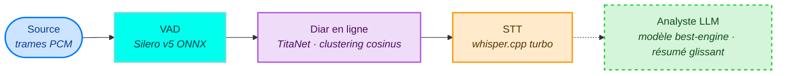
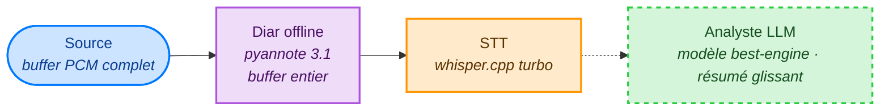

# Vocal Helper

[🇫🇷](https://github.com/warith-harchaoui/vocal-helper/blob/main/LISEZMOI.md) · [🇬🇧](https://github.com/warith-harchaoui/vocal-helper/blob/main/README.md)

[](https://github.com/warith-harchaoui/vocal-helper/actions/workflows/ci.yml)
[](https://github.com/warith-harchaoui/vocal-helper/blob/main/LICENSE)
[](#)
[](https://github.com/astral-sh/ruff)
[](https://github.com/warith-harchaoui/vocal-helper/blob/main/.github/PULL_REQUEST_TEMPLATE.md)
[](#la-promesse)

`Vocal Helper` fait partie de la collection `AI Helpers` : des bibliothèques Python pensées pour bâtir des outils d'intelligence artificielle.

[🌍 AI Helpers](https://harchaoui.org/warith/ai-helpers)

## La promesse

**Local d'abord, par conception.** vocal-helper tourne entièrement sur votre machine : transcription, diarisation et résumé se font en local (whisper.cpp / pyannote / NeMo / Ollama). Votre audio et vos transcriptions ne partent jamais vers un service tiers, aucune télémétrie, aucun compte, aucun verrouillage propriétaire. Votre voix, comme celle de toutes les personnes enregistrées, compte parmi les données les plus personnelles qui soient ; une transcription est le compte rendu mot pour mot de ce qui a été dit et par qui. Garder les deux sur votre propre matériel, c'est ce qui rend l'outil sûr à pointer sur une vraie réunion, un entretien ou une séance. Fait partie de la suite [AI Helpers](https://github.com/warith-harchaoui/ai-helpers) : la souveraineté sur vos données par l'Open Source local d'abord.

Vocal Helper est un **pipeline producteur/consommateur asynchrone** qui transforme un flux audio PCM (modulation d'impulsions codées) en direct en énoncés diarisés et transcrits, avec en option un résumé glissant produit par un LLM (grand modèle de langue).

## Documentation

[💻 Documentation](https://harchaoui.org/warith/ai-helpers/docs/vocal-helper-doc/)

[🗺️ Paysage](https://github.com/warith-harchaoui/vocal-helper/blob/main/PAYSAGE.md)

[📋 Exemples](https://github.com/warith-harchaoui/vocal-helper/blob/main/EXEMPLES.md)

## Pipeline

Toutes les frontières entre étages sont des `asyncio.Queue` bornées ;
chaque étage est sa propre coroutine. Les couleurs suivent la
[palette AI Helpers](https://harchaoui.org/warith/colors/).

### Online (streaming)


```mermaid
flowchart LR
    S([Source<br/><i>trames PCM</i>]):::source
      --> V[VAD<br/><i>Silero v5 ONNX</i>]:::vad
      --> D[Diar en ligne<br/><i>TitaNet · clustering cosinus</i>]:::diar
      --> A[STT<br/><i>whisper.cpp turbo</i>]:::asr
      -.-> L[Analyste LLM<br/><i>modèle best-engine · résumé glissant</i>]:::llm

    classDef source fill:#CCE4FF,stroke:#007AFF,stroke-width:2px,color:#0b3d91
    classDef vad    fill:#00ffef,stroke:#79dbdc,stroke-width:2px,color:#003b3c
    classDef diar   fill:#EFDCF8,stroke:#AF52DE,stroke-width:2px,color:#4a1063
    classDef asr    fill:#FFEACC,stroke:#FF9500,stroke-width:2px,color:#5a3300
    classDef llm    fill:#D4F5D9,stroke:#28CD41,stroke-width:2px,color:#144d1e,stroke-dasharray: 5 5
```

L'arête pointillée indique que l'analyste LLM est optionnel
(`llm=None` le désactive).

### Offline (batch)


```mermaid
flowchart LR
    S([Source<br/><i>buffer PCM complet</i>]):::source
      --> D[Diar offline<br/><i>pyannote 3.1<br/>buffer entier</i>]:::diar
      --> A[STT<br/><i>whisper.cpp turbo</i>]:::asr
      -.-> L[Analyste LLM<br/><i>modèle best-engine · résumé glissant</i>]:::llm

    classDef source fill:#CCE4FF,stroke:#007AFF,stroke-width:2px,color:#0b3d91
    classDef diar   fill:#EFDCF8,stroke:#AF52DE,stroke-width:2px,color:#4a1063
    classDef asr    fill:#FFEACC,stroke:#FF9500,stroke-width:2px,color:#5a3300
    classDef llm    fill:#D4F5D9,stroke:#28CD41,stroke-width:2px,color:#144d1e,stroke-dasharray: 5 5
```

Pas de VAD dans le chemin offline : la diarisation absorbe le buffer
complet et fait sa propre segmentation.

| Étage | Modèle | Notes |
|---|---|---|
| **VAD** (détection d'activité vocale) | Silero v5 ONNX (CPU, processeur central) | Fenêtre 32 ms, `activity_threshold=0.5`, `min_silence_ms=300` par défaut. |
| **Diarisation (online)** | `pyannote/embedding` (défaut) ou `nvidia/titanet_large` (NeMo) | Embedding par segment + clustering moyenne-mobile par distance cosinus, `join_threshold=0.30`. Calibré sur AMI dev-slice N=8 (2026-06-30). |
| **STT** (transcription de la parole) | [`pywhispercpp`](https://github.com/abdeladim-s/pywhispercpp) turbo | `large-v3-turbo-q5_0` par défaut, timestamps mots activés. Exécution en thread pool pour ne jamais bloquer la boucle async. |
| **Analyste LLM** *(optionnel)* | Modèle résolu via **best-engine-ai-helper** depuis le brief versionné `vocal_helper/llm.brief.yaml`, servi par Ollama ou vLLM | Résumé glissant de tout ce qui est **plus vieux que 60 s**. La fenêtre récente de 60 s reste verbatim. Aucun tag de modèle n'est codé en dur : `best-engine-ai-helper` résout le brief en un `llm.engine.yaml` spécifique à la machine (gitignoré) qui nomme le backend + le modèle et chaque requête passe par `best_engine_ai_helper.llm.chat`. |

## Installation

> **Déploiement sur un serveur GPU (processeur graphique) ?** Voir [TECHNICAL_STACK.md](https://github.com/warith-harchaoui/vocal-helper/blob/main/TECHNICAL_STACK.md)
> pour la recette complète : CUDA + PyTorch, whisper.cpp compilé avec
> `GGML_CUDA=on`, pyannote 3.1 sur MPS/CUDA, service systemd Ollama,
> RTF (facteur temps réel) attendus par GPU et un manifest
> d'installation reproductible en 10 étapes couvrant toute la suite
> AI Helpers (os-helper, audio-helper, podcast-helper, youtube-helper,
> vocal-helper, music-helper).

**Prérequis** : **Python 3.10–3.13** et **git**, **ffmpeg**, **PortAudio**, multiplateforme :

- 🍎 **macOS** ([Homebrew](https://brew.sh)) : `brew install python git ffmpeg portaudio`
- 🐧 **Ubuntu/Debian** : `sudo apt update && sudo apt install -y python3 python3-pip git ffmpeg portaudio19-dev`
- 🪟 **Windows** (PowerShell) : `winget install Python.Python.3.12 Git.Git Gyan.FFmpeg` (PortAudio est inclus dans les wheels Python)

Nous recommandons d'utiliser des environnements Python. Consultez ce lien si vous ne savez pas en configurer un : [🥸 Tech tips](https://harchaoui.org/warith/4ml/#install).

### Depuis PyPI (recommandé)

```bash
pip install 'vocal-helper[all]'
```

### Depuis les sources (sans PyPI)

```bash
pip install "vocal-helper[all]"
```

L'extra `[all]` installe les sources micro et stream, chaque backend de diarisation (NeMo par défaut, plus pyannote et sherpa) et la vérification croisée de langue. À la carte si tout n'est pas nécessaire :

| Extra | Apporte | Requis si |
|---|---|---|
| (aucun) | `os-helper`, `best-engine-ai-helper`, `audio-helper`, `numpy`, `scipy`, `silero-vad`, `pywhispercpp` | Sources fichier / numpy, VAD, ASR et l'analyste LLM font tous partie de l'installation de base |
| `[mic]` | `capture-helper` | Entrée microphone live |
| `[stream]` | `podcast-helper` | Source URL (YouTube, Vimeo, Twitch, flux RSS de podcast) |
| `[pyannote]` | `pyannote.audio` | `diar={'backend': 'pyannote'}` (repli plus léger, ~500 Mo) |
| `[nemo]` | `torch`, `nemo-toolkit[asr]` | `diar={'backend': 'nemo'}`, le backend par défaut : TitaNet, ~5 Go d'installation |
| `[sherpa]` | `sherpa-onnx` | `diar={'backend': 'sherpa'}`, le même TitaNet via onnxruntime : **sans PyTorch** et léger |
| `[llm]` | `best-engine-ai-helper` (déjà une dépendance cœur ; cet extra ne fait que la relister par intention) | Aucune installation séparée nécessaire, l'analyste LLM est déjà dans l'installation de base |
| `[lid]` | `speechbrain`, `torchaudio` | `voh.lid.cross_check_regions(...)`, une vérification croisée indépendante de la langue |
| `[cli]` / `[api]` / `[mcp]` | click, FastAPI + uvicorn, fastapi-mcp | Le CLI click, la surface HTTP et la surface MCP (voir le tableau des surfaces plus bas) |
| `[all]` | Tous les extras ci-dessus sauf `[studies]` | Installation en une ligne |

L'analyste LLM est déjà dans l'installation de base, mais il faut tout de même
résoudre l'engine une fois par machine avant que son backend de service ne
soit prêt. `best-engine-ai-helper` lit le brief versionné
`vocal_helper/llm.brief.yaml`, choisit le backend + le modèle pour votre matériel
(Ollama sur macOS / CPU, vLLM sur GPU discret) et écrit un
`vocal_helper/llm.engine.yaml` gitignoré. `voh.resolve_engine()` le fait à la
première utilisation ou explicitement :

```bash
# Depuis le dossier du paquet vocal_helper (qui contient llm.brief.yaml) :
best-engine-ai-helper resolve --brief llm.brief.yaml --out llm.engine.yaml
ollama serve   # la ligne `serve:` de l'engine nomme le `ollama pull …` exact
```

### Poids des modèles : aucun HuggingFace requis

Tous les poids sont fournis dans un **bundle diarization-engines**
auto-hébergé (pyannote 3.1 offline, NeMo Sortformer, l'embedder online
`pyannote/embedding`, SpeechBrain VoxLingua107 et le `sherpa` ONNX
sans PyTorch, segmentation pyannote-3.0 + TitaNet). On pointe `vocal-helper`
dessus une fois et toute la chaîne tourne **sans HuggingFace** : aucun
token, aucun téléchargement gated, compatible `HF_HUB_OFFLINE=1`.

La configuration tient dans `settings.yaml` (seule config nécessaire) :

```bash
cp settings.yaml.example settings.yaml
# settings.yaml contient déjà :
#   engines:
#     diarization_url: https://deraison.ai/diarization-engines-slim.zip
# settings.yaml est gitignoré.
```

L'URL du bundle est téléchargée une fois puis mise en cache sous
`~/.cache/vocal-helper` ; vous pouvez aussi pointer
`$VH_DIARIZATION_ENGINES` vers un dossier local. TitaNet (embedder online
par défaut) se charge depuis NVIDIA NGC, sans HuggingFace non plus.

### Micro live → terminal

```bash
# Aucun token, aucun HuggingFace : les poids viennent du bundle diarization-engines.
vocal-helper mic --llm
```

### API Python

```python
import asyncio
import vocal_helper as voh

async def main():
    pipeline = voh.Pipeline(
        source=lambda: voh.sources.from_microphone(),
        config=voh.PipelineConfig(
            diar={"backend": "pyannote"},
            asr={"model": "large-v3-turbo-q5_0", "language": "auto"},  # découverte depuis l'audio
            llm={"engine": voh.resolve_engine()},   # retirer pour désactiver
        ),
    )
    async for ev in pipeline.run():
        if "text" in ev:
            print(f"[{ev['t0']:.1f} {ev['speaker']}] {ev['text']}")
        elif "summary" in ev:
            print(f"--- résumé glissant ---\n{ev['summary']}")

asyncio.run(main())
```

### Rejouer un WAV à travers le pipeline

```bash
vocal-helper file chemin/vers/conversation.wav --llm
```

La source fichier respecte le tempo réel par défaut ; `--no-real-time` accélère le traitement (mode batch).

### Traitement **offline** en lot sur un WAV (pyannote 3.1 buffer entier)

```python
import asyncio, vocal_helper as voh

async def main():
    pipeline = voh.OfflinePipeline(
        source=lambda: voh.sources.from_wav_file(
            "reunion.wav", real_time=False
        ),
        config=voh.OfflinePipelineConfig(
            diar={"backend": "pyannote"},   # ou "nemo" pour les extraits ≤ 60 s
            asr={"language": "auto"},       # découvert depuis l'audio, aucun défaut
            llm={"engine": voh.resolve_engine()},    # retirer pour désactiver
        ),
    )
    async for ev in pipeline.run():
        if "text" in ev:
            print(f"[{ev['t0']:.1f} {ev['speaker']}] {ev['text']}")
        elif "summary" in ev:
            print(f"--- digest ---\n{ev['summary']}")

asyncio.run(main())
```

Quel pipeline utiliser, sachant que le [routeur](#routeur-de-backend-laiguilleur) choisit le backend pour vous :

| Cas d'usage | Pipeline | Backend (choix du routeur) | Pourquoi |
|---|---|---|---|
| Micro live / flux live | `Pipeline` | `nemo` online | Diarisation temps réel + transcript à RTF ≈ 0,03. L'online est une approximation limitée par la latence (~3-4× le DER offline) ; `nemo` est le meilleur embedder online à toute longueur. |
| Réunion / podcast / conférence / messagerie vocale en lot | `OfflinePipeline` | `pyannote` 3.1 | pyannote sur l'audio entier donne la réponse la meilleure qualité, médiane AMI DER 0,116, dans la bande Bredin 2023 ; NeMo bloque au-delà de ~25 min. |
| Extraits ≤ 60 s, ≤ 4 locuteurs, traitement rapide | `OfflinePipeline(backend='nemo')` | Sortformer `nemo` | Attribution bout-en-bout, confusion ≈ 0, RTF ≈ 0,004 (250×). |
| Sur poste sans PyTorch | l'un ou l'autre, `backend='sherpa'` | `sherpa` ONNX | TitaNet-large sans PyTorch, DER 0,174/0,148, FR+EN, embarquable partout. |

## Exposition multi-surface

`vocal-helper` expose la même pipeline via des surfaces cohérentes, une bibliothèque Python, deux CLI, une API HTTP (interface de programmation), un agent compatible MCP (Model Context Protocol) et une **interface web de lecture de transcription**, sans re-câbler la logique ailleurs.

| Surface | Point d'entrée | Extra | Usage |
|---|---|---|---|
| CLI argparse | `vocal-helper` | (aucun, livré avec l'install de base) | Scripts shell, cron, CI headless, redirection vers `jq`. |
| CLI click | `vocal-helper-click` | `[cli]` | `--help` riche, complétion shell, sous-commandes chaînées. |
| HTTP FastAPI | `uvicorn vocal_helper.api:app` | `[api]` | Derrière un reverse proxy : upload d'un fichier (ou champ `url`), réponse transcription/événements, `GET /docs` pour l'OpenAPI. |
| Outils MCP | `vocal-helper-mcp` | `[api,mcp]` | N'importe quel hôte compatible MCP (runtimes d'agent, intégrations IDE) : publie `transcribe` et `pipeline` comme outils natifs. |
| Interface web | `GET /gui` (servie par l'API) | `[api]` | Une page navigateur sans build : déposez un fichier ou collez une URL → **transcription colorée par locuteur + résumé glissant**. `/` y redirige. |

```bash
# argparse ; la langue est découverte par défaut ('auto'), --language xx ne sert qu'à la forcer
vocal-helper transcribe clip.wav
vocal-helper file reunion.wav --offline --llm

# jumeau click
vocal-helper-click transcribe clip.wav

# surface HTTP + interface web (ouvrez http://127.0.0.1:8000/gui)
uvicorn vocal_helper.api:app --host 0.0.0.0 --port 8000 &
curl -F 'file=@clip.wav' -F 'language=fr' http://localhost:8000/transcribe
curl -F 'url=https://youtu.be/…' http://localhost:8000/pipeline  # URL récupérée localement ([stream])

# surface MCP (même app FastAPI + endpoint /mcp monté)
vocal-helper-mcp
```

### L'interface de lecture de transcription (`GET /gui`)

Une page unique autonome (HTML + Tailwind CDN + JS vanilla, sans build) servie
en **same-origin** par l'API. Déposez un fichier audio **ou collez une URL**,
lancez la transcription diarisée localement et lisez une **transcription
étiquetée et colorée par locuteur** (une couleur stable par locuteur) à côté du
résumé glissant. Elle appelle le même endpoint `/pipeline` (aucune logique
serveur supplémentaire) et ne contacte que le serveur local : votre audio ne
quitte jamais la machine.

### En tant que skill d'agent

`skills/vocal-helper/` empaquette vocal-helper comme **skill Claude** *et* skill
**OpenCode**. Voir [`skills/README.md`](https://github.com/warith-harchaoui/vocal-helper/blob/main/skills/README.md) pour l'installer
(liens symboliques vers `~/.claude/skills/` et `~/.opencode/skills/`) et
[`TRIGGERS.md`](https://github.com/warith-harchaoui/vocal-helper/blob/main/TRIGGERS.md) pour le catalogue exhaustif des déclencheurs.

## Abonnés : fan-out sans posséder la boucle

Chaque étage peut être observé sans consommer le flux fusionné :

```python
async def on_voiced(seg): print("VAD :", seg["t0"], seg["t1"])
async def on_diar(seg):   print(" → ", seg["speaker"], seg["t0"], seg["t1"])

pipeline.subscribe_voiced(on_voiced)
pipeline.subscribe_diarized(on_diar)

async for ev in pipeline.run():
    ...
```

Pratique pour des relais WebSocket / SSE, du rendu UI (interface utilisateur) live ou une persistance JSONL.

## Routeur de backend : l'*aiguilleur*

La diarisation est la seule étape où le choix du backend se pose vraiment et il n'y a
**aucun vainqueur unique** : le meilleur backend dépend du scénario.
`vocal_helper.router` (`voh.select_diarization`) transforme ce compromis mesuré
en **une** décision explicite et testée, pour que la CLI et votre code ne codent
jamais un backend en dur ; il rapporte **qualité (DER, taux d'erreur de diarisation) et vitesse (RTF)**, pas
seulement un nom. Les chiffres ont été **re-validés sur machine**
(`studies/router_profile_validation.py`, `pyannote.metrics` collar 0.25, DER +
RTF médians) contre la vérité terrain : bagarre (30 mixes courts) + AMI
dev-slice ; `sherpa` depuis l'ADR 0002. **DER** = qualité (plus bas = mieux) ;
**RTF** = vitesse (`< 1` plus rapide que le temps réel) :

| Mode | Scénario | Backend | DER (qualité) | RTF (vitesse) | Pourquoi |
|---|---|---|---|---|---|
| offline | court ≤ 300 s, ≤ 4 locuteurs | **`nemo`** | **0.142** | 0.051 | Attribution de slot bout-en-bout, confusion ~0 ; ~2,3× mieux que pyannote sur tours courts et denses (0.330). |
| offline | long / inconnu / > 4 locuteurs | **`pyannote`** | **0.122** | 0.067 | Défaut robuste, médiane AMI dans la bande Bredin 2023 ; NeMo bloque au-delà de ~25 min, plafonne à 4 locuteurs. |
| offline | sans torch (pas de PyTorch) | **`sherpa`** | 0.174 / 0.148 | 0.58 | ONNX TitaNet-large, bat NeMo Sortformer 0.267, FR+EN validé (ADR 0002). |
| online | tout flux live | **`nemo`** | 0.586 | 0.030 | Meilleur embedder online à toute longueur (bat pyannote online 0.590/0.844). L'online est une approximation ~3–4× l'offline limitée par la latence ; `refine_on_close` aide les longues réunions. |
| online | sans torch | **`sherpa`** | 0.174 | 0.58 | Re-diarisation offline périodique (le sherpa online par segment est une impasse, ADR 0002). |

Deux constats, tous deux mesurés ici : l'**offline** a un vrai croisement de
longueur (nemo court ↔ pyannote long), d'où le routeur ; l'**online** n'en a pas
— le clusterer streaming de vocal-helper est une approximation limitée par la
latence où nemo gagne à toute longueur, donc le streaming route toujours vers
nemo. `voh.select_diarization(live=…, duration_s=…, max_speakers=…,
torch_free=…, pyannote_available=…)` retourne un `BackendPlan(mode, backend,
expected_der, expected_rtf, reason)` ; les chiffres qualité/vitesse sont des
champs de première classe et `reason` porte la citation, pour qu'un choix ne soit
jamais une boîte noire.

```python
import vocal_helper as voh
plan = voh.select_diarization(live=False, duration_s=45.0, max_speakers=3)
print(plan.backend, plan.expected_der, plan.expected_rtf)  # nemo 0.142 0.051, court, ≤4 locuteurs
print(voh.select_diarization(live=False, duration_s=1800.0).backend)  # 'pyannote', forme longue
```

Le routeur est **appliqué, pas indicatif** : `--diar-backend` vaut **`auto`** par
défaut sur les deux CLI et sur `POST /pipeline` ; la durée réelle du fichier est
sondée puis routée (court → `nemo`, long → `pyannote`) sans choix manuel. Passez
un `pyannote` / `nemo` / `sherpa` explicite pour forcer.

## Choix de diarisation : pourquoi le clustering cosinus online

L'étude `pdbms` (2026-06-29, N=2089 par système) classe les diariseurs
streaming online ainsi :

| Mode | Recommandé | DER (propre) |
|---|---|---|
| Streaming ≤ 300 s | `hungarian_nemo` (w=20 s) | 0,13 – 0,20 |
| Streaming > 300 s | `hungarian_pyannote` (w=30 s) | 0,30 – 0,45 |

Vocal Helper spécialise cette décision : comme la VAD isole déjà chaque
segment vocal, la machinerie à fenêtre glissante se réduit à un embedding par
segment plus un clustering moyenne-mobile par distance cosinus. Le
`join_threshold=0,30` par défaut est la valeur retenue sur AMI dev-slice N=8
dans le `pyannote_stitch_threshold_sweep` du 2026-06-30.

## Identification de la langue parlée

Avant même de transcrire un mot, `vocal_helper.lid` détermine **quelle langue
est parlée** pour le fichier entier ou par région dans un enregistrement où
l'on alterne les langues. C'est décisif : une passe whisper `"auto"` se
verrouille sur la première langue entendue et *traduit* le reste dans
celle-ci ; identifier la langue acoustiquement **d'abord** permet de
transcrire chaque région dans sa propre langue. Cela rattrape aussi les
données mal étiquetées : sur un corpus de 423 appels, le recensement
acoustique a corrigé l'étiquette de dossier de 21 fichiers (des appels
anglais et néerlandais rangés sous « FR », etc.).

**La langue est découverte : aucune langue par défaut, aucun appariement.** La
détection renvoie la langue que l'audio *est réellement* (l'argmax réel de
whisper sur l'ensemble de sa tête de langues). Il n'y a ni langue par défaut ni
paire de langues : la langue est découverte à partir de l'audio lui-même.

| Fonction | Rôle |
|---|---|
| `detect_language(pcm)` | Une détection globale. Renvoie `(iso_639_1, probabilité)` pour la langue effectivement détectée par whisper : n'importe quelle langue, pas un sous-ensemble privilégié. |
| `detect_language_regions(pcm)` | Découpe un audio multilingue en `LangRegion`s mono-langue via une **courbe de postérieurs** à fenêtres chevauchantes : lissée par gaussienne, frontières raffinées localement puis calées sur le silence le plus proche. Un audio vide / trop court ne renvoie aucune région plutôt que d'en inventer une. |
| `detect_language_regions_fast(pcm)` | Chemin rapide *(nouveau en 0.4.2)* : une détection globale bon marché ; si elle dépasse le seuil de confiance (`DEFAULT_FAST_CONF_GATE`, 0.5), le fichier est traité comme monolingue (une seule région), sinon repli sur le scan complet. **~73 s → ~1 s par fichier** sur la majorité monolingue, sortie identique. |
| `cross_check_regions(pcm, regions)` | Vérification indépendante optionnelle via SpeechBrain VoxLingua107 (livré dans le bundle diarization-engines) : un second avis, issu d'un autre modèle, sur la langue de chaque région, rapporté tel quel. |

```python
import vocal_helper as voh

# Chemin rapide, le bon défaut pour un corpus batch majoritairement monolingue :
regions = voh.detect_language_regions_fast(pcm, 16_000)
for r in regions:
    print(f"{r.lang}  [{r.t0:.1f}–{r.t1:.1f}s]")
```

**Indice de routage optionnel.** Si vous ne savez router qu'un ensemble fixe de
langues, passez `supported=("en", "fr", "es", "it", "pl", "nl")` pour re-classer
la détection à l'intérieur de cet ensemble (afin qu'un proche non routable, le
galicien devant l'espagnol sur une fenêtre courte, ne l'emporte jamais). C'est
entièrement optionnel : laissez-le à `None` (le défaut) et l'audio parle de
lui-même.

## Feuille de route

Déjà livré depuis la première version de cette liste : l'écriture JSONL
(`--jsonl`) et le sélecteur automatique d'engine LLM (`voh.resolve_engine()`,
arrivé en `2.0.0`). Ce qui reste ouvert :

- `SemanticEOTStage` activé par défaut, une fois confirmée à l'échelle la
  réduction des coupures fausses sur AMI de l'étude EOT du 2026-06-30 (façon
  LiveKit ; voir `studies/eot_semantic_vs_silero.py`). Il est disponible dès
  aujourd'hui derrière le drapeau optionnel `--eot`.
- Un relais WebSocket standard pour le pipeline online. La surface FastAPI
  (`vocal_helper.api`) reste volontairement offline uniquement ; une surface
  WebSocket pour le chemin streaming est prévue mais vit en dehors de ce
  paquet pour l'instant.
- Rejet verrouillé par langue des hallucinations Whisper sur silence.
- Hors périmètre par conception : ancrage d'identité de locuteur via des
  empreintes vocales pré-enregistrées, exclu par les contraintes de conformité
  du déploiement industriel de l'utilisateur. Les identités restent anonymes
  (`S0`, `S1`, …) au sein d'une session.
- Remplacer le `_PyannoteEmbedder` interne par la variante consciente du
  recouvrement de `pdbms.diar.backends.pyannote.embed_overlap_aware` pour les
  mixages bruités.
- Événements Frame typés façon Pipecat avec une file `SystemFrame` prioritaire
  dans le pipeline de production lui-même (arrêt propre, signaux de contrôle
  hors bande qui court-circuitent les files de données). `vocal_helper.parallel_pipelines`
  porte déjà le primitif de fan-out de Pipecat, mais seulement pour les
  scripts d'étude sous `studies/`, pas pour `Pipeline`/`OfflinePipeline`.

## Versionnage & stabilité

`vocal-helper` a atteint sa première version stable en `1.0.0` et se trouve
aujourd'hui en `2.x`, suivant le [versionnage sémantique](https://semver.org) :

- L'**API publique**, c'est `vocal_helper.__all__` plus les options CLI
  documentées. C'est à cela que s'appliquent les promesses de stabilité.
- **Les changements de comportement ou de défauts n'arrivent qu'en version
  MAJEURE** (`1.x` → `2.0.0`). Une version **MINEURE** ajoute des
  fonctionnalités de façon compatible ; un **correctif** ne touche qu'aux bugs
  et à la documentation, jamais à un défaut.
- `2.0.0` est la seule version majeure livrée depuis `1.0.0` : elle a remplacé
  le tag de modèle LLM codé en dur par un engine résolu par machine depuis un
  brief versionné (voir le CHANGELOG), ce qui a changé la surface CLI/API de
  l'analyste, d'où le saut de version majeure plutôt que mineure.
- Les dépréciations reçoivent une version avec avertissement avant suppression.

## Auteur

[Warith HARCHAOUI](https://linkedin.com/in/warith-harchaoui), `warith@deraison.ai`

## Remerciements

Un grand merci à
[Mohamed Chelali](https://mchelali.github.io),
[Bachir Zerroug](https://www.linkedin.com/in/bachirzerroug)
et
[Edmond Jacoupeau](https://www.crunchbase.com/person/edmond-jacoupeau).

## Licence

Ce projet est distribué sous licence BSD-3-Clause : voir le fichier [LICENSE](https://github.com/warith-harchaoui/vocal-helper/blob/main/LICENSE) pour les détails.
