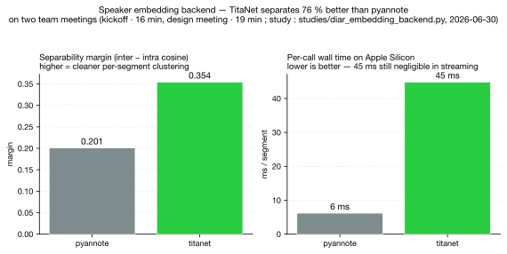
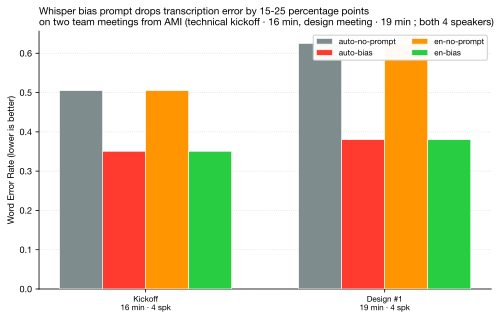
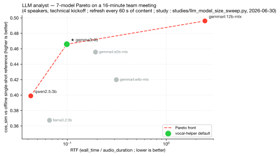
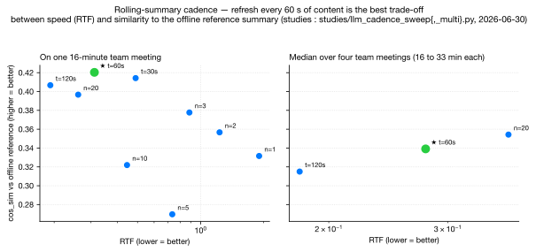

# Résumé

`vocal-helper` est un **pipeline vocal producteur/consommateur**
asynchrone pour `Python ≥ 3.10`. Il transforme un flux PCM
(modulation d'impulsions codées) en
direct ou enregistré en énoncés diarisés, transcrits, et (en
option) en résumé glissant produit par un LLM (grand modèle de langue). Deux pipelines :
`Pipeline` pour le streaming (microphone, URL, flux podcast), et
`OfflinePipeline` pour le batch (enregistrements de réunion,
archives de messagerie vocale). Chaque défaut de ce rapport est
justifié par une étude empirique sous `studies/` dont le log + le
JSON vit sur le disque de recherche. La bibliothèque est sous
licence BSD-3-Clause, local-first, et pensée pour s'intégrer au
reste de la suite [AI Helpers](https://harchaoui.org/warith/ai-helpers)
(la base de recherche amont est `pdbms` [@pdbms]).

# 1. Objectifs et non-objectifs

## 1.1 Objectifs

- **Micro live → transcript diarisé + résumé glissant LLM**, le tout
  local, sur Apple Silicon ou Linux + NVIDIA, sans aller-retour
  cloud dans le chemin par défaut.
- **Batch offline** sur un enregistrement de réunion — diarisation
  de la meilleure qualité (`pyannote/speaker-diarization-3.1`
  [@pyannotediarization], auto-chunk + stitch au-delà de 300 s) →
  ASR (reconnaissance automatique de la parole) → résumé optionnel.
- **Défauts justifiés empiriquement.** Chaque levier est calé par
  une étude reproductible sur le corpus AMI Meeting Corpus
  [@carletta2007unleashing] dev-slice. Aucun défaut tiré d'un
  blog marketing.
- **Queues producteur/consommateur** entre étages pour que chaque
  étage tourne à sa propre cadence — l'analyste LLM reste à
  RTF (facteur temps réel) ≈ 0.1 tandis que le VAD (détection d'activité vocale) est à RTF ≈ 1e-5.

## 1.2 Non-objectifs

- Pas d'enrôlement de voiceprint. Les IDs de locuteur restent
  anonymes `S0`, `S1`, … au sein d'une session ; jamais persistés
  vers une identité nommée entre sessions. Contrainte de conformité
  pour le déploiement industriel.
- Pas de sortie LLM en streaming token/caractère. Chaque appel LLM
  retourne la réponse complète une fois prête. Préférence UX (expérience utilisateur).
- Pas de transport WebRTC / multi-participant en v0.x. Utiliser
  `livekit-agents` [@livekitagents] pour ça.
- Pas de TTS (synthèse vocale) pour v0.1.0 (ajouté en option v0.2.0 via
  `vocal_helper.tts.PiperTTS` — voir §4).

# 2. Architecture du pipeline

## 2.1 Pipeline online

```
[Source]   →  [VAD]   →  [Diar online]    →  [STT]   →  [Analyste LLM (optionnel)]
  trames      segments  segments              texte         résumé glissant
  PCM         voisés    étiquetés par
                        locuteur
```

En option, un `SemanticEOTStage` se place entre `VAD` et `Diar
online` (opt-in, §3.5).

## 2.2 Pipeline offline

```
[Source]   →  [Diar offline]    →  [STT]  →  [Analyste LLM (optionnel)]
  PCM         buffer complet       texte      résumé glissant
  complet     pyannote 3.1
              + chunk+stitch
              au-delà de 300 s
```

## 2.3 Arêtes

Chaque flèche est une `asyncio.Queue` bornée à `qsize_pcm = 200`
(4 s d'audio en flight à 20 ms/trame) ou `qsize_seg = 32`. La
sentinelle `None` se propage proprement à travers chaque étage en
shutdown. Les abonnés (`subscribe_voiced` / `subscribe_diarized`
/ `subscribe_utterances`) font fan-out vers des consommateurs
secondaires sans back-pressure sur la chaîne principale.

# 3. Conception étage par étage & choix de défauts

## 3.1 VAD — Silero v5

Défaut `SileroVADStage(activity_threshold=0.5, min_silence_ms=300,
min_speech_ms=300, edge_pad_ms=200, sample_rate=16000)` utilisant
Silero v5 [@silero] ONNX sur CPU (processeur central). Le point de fonctionnement
cadence 48 ms + seuil 0.5 est le canon pdbms validé dans
l'étude amont `vad-cadence-study.md` §10. Le seuil de silence
300 ms se trouve dans la fenêtre conversationnelle rapportée à la
fois par LiveKit [@livekitturnblog] et le cadre fondateur de
turn-taking Sacks–Schegloff–Jefferson [@sacks1974simplest] —
les humains répondent naturellement après 200-300 ms.

## 3.2 Diarisation online — embeddings TitaNet (défaut)

`OnlineDiarStage` consomme les événements `VoicedSegment` du VAD,
embede chacun une fois, et fait tourner un clusterer cosinus à
moyenne mobile par segment sur la liste globale des locuteurs.
Trois backends d'embedding sont câblés :

- `backend='nemo'` — NVIDIA TitaNet [@titanet] via NeMo [@nemo].
- `backend='pyannote'` — `pyannote/embedding` [@pyannoteembedding].
- `backend='sherpa'` — le même TitaNet-large via
  `sherpa-onnx`/onnxruntime, **sans torch** : install léger et
  embarquable partout (DER 0.174, taux d'erreur de diarisation, FR+EN validé ; ADR 0002). Ses poids
  ONNX sont fournis dans le bundle diarization-engines, donc ce chemin
  tourne sans PyTorch et sans HuggingFace.

**Le défaut est `nemo` (TitaNet)**, sélectionné par le sweep
backend d'embedding Été 2026
(`studies/diar_embedding_backend.py`) sur AMI N=2 :

| backend  | médiane cos intra | médiane cos inter | **marge (inter − intra)** | wall / call |
|----------|------------------:|------------------:|--------------------------:|------------:|
| pyannote | 0.739 | 0.940 | 0.201 | **6 ms** |
| **TitaNet** | 0.560 | 0.915 | **0.354** | 45 ms |



La marge de séparabilité de TitaNet est **76 % plus large**, au
prix d'une latence par appel ×7 — négligeable par segment voisé
dans un workload streaming. Le coût est l'install footprint :
NeMo + torch font ~ 5 GB ; passer `backend='pyannote'` pour s'en
passer.

`join_threshold = 0.30` et `ema_alpha = 0.1` ont été hérités du
sweep pdbms Été 2026 sur `ChunkedOfflineDiarizer` (le plateau
cosinus sur AMI dev-slice N=8 est à {0.30, 0.35, 0.40} avec
médiane DER 0.135 vs baseline 0.116). La même calibration se
transfère parce que la distribution d'embedding est la même.

## 3.3 Diarisation offline — pyannote 3.1 avec auto-chunking

`OfflineDiarStage` consomme le buffer PCM complet et le confie à
`pyannote/speaker-diarization-3.1` [@pyannotediarization]. Pour
les entrées plus longues que `ideal_duration_s` (300 s pour
pyannote, 60 s pour l'alternative NeMo Sortformer [@sortformer]),
l'audio est chunké avec `overlap_s = 10 s` et stitché via AHC
cosinus à `stitch_threshold = 0.35` (le centre du plateau pdbms).
Le chemin NeMo Sortformer reste opt-in : il domine sur les clips
≤ 60 s mais hang au-delà de son cap d'entraînement à 90 s, donc
vocal-helper ne l'expose pas en défaut.

Le backend `sherpa` sans torch regroupe tout le buffer dans un seul
appel `sherpa-onnx`, si bien que `stitch_threshold` ne s'y applique
pas. Son clustering était auparavant figé en dur, avec un seuil
`FastClustering` de `0.5` et un nombre de locuteurs de `-1` (auto). Ce
`0.5` a été réglé sur l'audio de réunion AMI propre ; sur la
téléphonie à deux parties, bruitée et expurgée, il sur-segmente en ~36
locuteurs. Depuis la **v0.7.0**, `OfflineDiarStage` transmet
`sherpa_cluster_threshold` et `sherpa_num_clusters` à cette
configuration (défauts inchangés). Un sweep du 2026-07-23 contre une
vérité terrain silver pyannoteAI a montré que relever le seuil ne
corrige le problème que lentement (~30 locuteurs à `0.6`). Fixer
`sherpa_num_clusters=2` ramène la téléphonie au bon compte : c'est la
valeur à utiliser quand le nombre de locuteurs est connu (appels à
deux parties).

## 3.4 STT — pywhispercpp turbo avec bias prompt

`WhisperStage(model="large-v3-turbo-q5_0", language="auto",
threads=6, word_timestamps=True, initial_prompt="",
min_segment_ms=250)` enveloppant pywhispercpp [@pywhispercpp] →
whisper.cpp [@whispercpp] → OpenAI Whisper [@radford2023whisper]
turbo [@whisperturbo].

Le levier le plus impactant à lui seul est `initial_prompt`. Le
sweep 2026-06-30 (`studies/whisper_prompt_lang_lock.py`) sur AMI :

| config | meeting | WER | RTF |
|---|---|---:|---:|
| sans prompt | IS1008a | 0.505 | 0.044 |
| **+ bias prompt** | IS1008a | **0.351** | 0.043 |
| sans prompt | ES2011a | 0.625 | 0.067 |
| **+ bias prompt** | ES2011a | **0.380** | 0.041 |



Un prompt de biais aligné domaine baisse le WER (taux d'erreur de mots) de **15 à 25
points de pourcentage** et économise jusqu'à **39 % de RTF**. Le
prompt doit nommer le domaine et une poignée de noms propres ou
termes techniques attendus. Le défaut est la chaîne vide (le
chemin zero-config marche) mais le docstring + l'aide CLI + le
EXAMPLES.md poussent tous le caller à en fournir un.

Le verrouillage de langue (`language="en"` vs `"auto"`) a un effet
négligeable sur la qualité dans ce sweep — garder `"auto"` sauf
raison forte de production.

**Comparaison de moteurs STT (transcription de la parole) — pywhispercpp vs faster-whisper**
(`studies/stt_faster_whisper_vs_pywhispercpp.py`, 2026-07-01) :

| moteur | IS1008a WER | IS1008a RTF | ES2011a WER | ES2011a RTF |
|---|---:|---:|---:|---:|
| **pywhispercpp** | 0.358 | **0.037** | 1.398 ⚠ | **0.039** |
| faster-whisper [@fasterwhisper; @ctranslate2] | 0.360 | 0.342 | 0.466 | 0.337 |

`pywhispercpp` est **~ 10× plus rapide** sur Apple Silicon
(inférence Metal native) à WER équivalent sur la réunion propre,
mais **hallucine catastrophiquement sur ES2011a** (WER 1.398 =
émet plus de texte que la référence). `faster-whisper` est plus
lent (chemin CPU de CTranslate2) mais plus robuste. Le défaut
reste `pywhispercpp` pour l'avantage RTF en streaming ; le travail
futur devrait ajouter une détection d'hallucination (seuil de
perplexité de token) avec un fallback `faster-whisper` plutôt que
de swap les moteurs entièrement.

## 3.5 Fin de tour sémantique — opt-in

`SemanticEOTStage` (opt-in via `PipelineConfig.eot`) se place
entre VAD et diar online. Pour chaque `VoicedSegment` entrant :

1. Whisper-transcrire un partiel (même modèle que le `WhisperStage`
   en aval, dans un thread pool).
2. Demander à un petit LLM classifieur (`qwen2.5:3b` [@qwen25] par
   défaut) si le transcript partiel est une pensée complète.
3. Si complète → émettre. Si incomplète → la mettre en attente,
   attendre le segment suivant, fusionner, reclassifier. Émission
   forcée au bout de `max_merge_s = 4 s` d'accumulation.

Inspiration : le turn-detector v1.0 de LiveKit
[@livekitturndetector] (2026-04), qui a distillé Qwen2.5-0.5B
[@qwen25] depuis un teacher Qwen2.5-7B, fusionnant une branche
sémantique et une branche acoustique. LiveKit reporte 9.9 % de
false-cutoff à 300 ms de latence sémantique médiane.

**Résultat honnête sur AMI IS1008a**
(`studies/eot_semantic_vs_silero.py`, 2026-07-01) :

| config | n_segments | n_false_cuts | false_cut_rate |
|---|---:|---:|---:|
| Silero VAD seul (baseline) | 160 | 40 | 0.250 |
| Silero + `SemanticEOTStage` | 148 | 38 | 0.257 |

Notre première version sémantique-seul **n'améliore pas le
false-cut rate** sur AMI par rapport au baseline silence-threshold
seul. La latence médiane du classifieur est ~230 ms par appel (vs
10-25 ms chez LiveKit), donc le trade-off d'ingénierie est aussi
défavorable. L'étage est livré opt-in et gardé dans la base comme
échafaudage pour un drop-in futur du vrai modèle turn-detector
distillé de LiveKit — le classifieur qwen2.5:3b généraliste est
trop grossier pour cette tâche à cette taille.

## 3.6 Analyste LLM — Gemma 3 4b avec cadence temporelle

`GemmaAnalystStage(model="gemma3:4b", recent_window_s=60.0,
flush_every_s=60.0, flush_every_n=5)` enveloppant Ollama
[@ollama].

Le modèle par défaut `gemma3:4b` [@gemma3] est le vainqueur Pareto
du sweep 7-modèles Été 2026
(`studies/llm_model_size_sweep.py`) sur AMI IS1008a avec cadence
`flush_every_s=60` :

| modèle | RTF | cos_sim |
|---|---:|---:|
| gemma4:e2b-mlx [@gemma4] | 0.193 | 0.456 |
| gemma4:e4b-mlx (ancien défaut) | 0.313 | 0.420 |
| gemma4:12b-mlx | 2.453 | **0.496** |
| **gemma3:4b** | **0.099** | **0.466** |
| qwen2.5:3b [@qwen25] | 0.043 | 0.399 |
| qwen3:8b [@qwen3] | 1.628 | 0.350 |
| llama3.2:3b [@llama32] | 0.066 | 0.367 |



`gemma3:4b` **domine l'ancien défaut sur les deux axes** : RTF
3 × plus rapide ET cos_sim supérieur vs résumé de référence
offline single-shot. Le front Pareto expose aussi
`gemma4:12b-mlx` (RTF 2.453, cos_sim 0.496) pour le batch
offline et `qwen2.5:3b` (RTF 0.043, cos_sim 0.399) pour les
budgets RTF serrés.

Le défaut de cadence `flush_every_s = 60` a été sélectionné par
deux sweeps complémentaires :

- mono-meeting (`studies/llm_cadence_sweep.py`) sur AMI IS1008a :
  t=60s gagne sur cos_sim (0.420).
- médiane multi-meeting (`studies/llm_cadence_sweep_multi.py`)
  sur IS1008a + ES2011a + ES2011d + TS3004a : t=60s donne
  RTF 0.278 / cos_sim 0.339 ; n=20 donne RTF 0.369 / cos_sim
  0.354. L'écart de 0.015 cos_sim est dans le bruit
  inter-meeting (cos_sim varie de 0.279 à 0.471 pour le même
  config), et t=60s est 25 % plus rapide.



## 3.7 Moteur de service LLM — Ollama (défaut), avec politique adaptative

La comparaison de moteurs `studies/llm_engine_comparison.py`
trouve que Ollama [@ollama] est le seul moteur qui charge
proprement sur Apple Silicon aujourd'hui (le support Metal de
vLLM [@vllm] est expérimental ; mlx-lm [@mlxlm] requiert un
install manuel). Sur autre matériel (Linux + NVIDIA), vLLM serait
le moteur recommandé.

La roadmap envisage une politique d'auto-détection : Ollama avec
poids tagués MLX sur macOS, vLLM sur Linux + CUDA, llama.cpp /
Ollama avec gguf en fallback universel. Le levier n'est pas
implémenté en v0.1.0 — les callers peuvent surcharger via
`GemmaAnalystStage.host` ou en swappant le `model` tag.

## 3.8 TTS — Piper (opt-in)

`vocal_helper.tts.PiperTTS` enveloppe Piper [@piper] pour de la
TTS neuronale locale CPU-only. Voix par défaut
`en_US-amy-medium` (anglais) et `fr_FR-siwis-medium` (français) ;
le catalogue complet est sur `rhasspy/piper-voices`
[@pipervoices]. La synthèse est one-shot — pas de streaming
chunk, conforme à la contrainte no-character-stream — et exposée
comme un helper que le caller câble dans son propre subscriber
(typiquement sur événements `Utterance` ou `SummarySnapshot`)
plutôt que comme un étage du pipeline. Cela garde vocal-helper
transcription-first tout en rendant la boucle audio-out
ferméable en deux lignes côté caller.

# 4. Pistes ouvertes

## 4.1 Distillation Whisper mono-langue

Le défaut actuel `large-v3-turbo-q5_0` [@whisperturbo] est la
distillation OpenAI d'octobre 2024 de large-v3 vers un décodeur
4-couches, gardé multilingue. Les déploiements verrouillés sur
une langue ont trois niveaux de coût croissant :

1. **Zéro entraînement — distillations par-langue publiées.**
   Pour l'anglais, `distil-whisper/distil-large-v3`
   [@distilwhisper; @distilwhispercard] reporte ~ 6 × de débit à
   WER équivalent. Pour le français, la famille de Bofeng Huang
   [@bofenghuangfrench] : `whisper-large-v3-french` (fine-tune
   complet), `-distil-dec16` (~ 2 ×), `-distil-dec8` (~ 4 ×),
   `-distil-dec4` (~ 8 × — correspond à la topologie 4-couches
   décodeur de turbo, mono-français). Intégration : soit basculer
   whisper.cpp sur `faster-whisper` [@fasterwhisper; @ctranslate2]
   qui charge les checkpoints HF directement, soit convertir les
   poids HF en `.gguf` via le script
   `models/convert-h5-to-ggml.py` de `whisper.cpp` et les
   quantiser en `q5_0` pour `pywhispercpp`.

2. **Fine-tuner le turbo existant vers une langue (1-3 jours GPU, processeur graphique).**
   Continuer l'entraînement de `large-v3-turbo` sur Common Voice
   [@commonvoice] + Multilingual LibriSpeech
   [@multilinguallibrispeech] + le corpus production de
   l'utilisateur avec le token de langue verrouillé et un learning
   rate bas (~1e-6). Attendu : même nombre de paramètres, +2 à
   +5 pp WER sur la langue cible, pas de gain de vitesse.
   Coût : 20-50 A100-heures.

3. **Distillation complète style Distil-Whisper de turbo vers un
   student spécialisé langue (1-3 semaines GPU).** Architecture :
   student décodeur 4-couches (même topologie que turbo),
   encodeur entier gardé ; loss : KL-divergence sur logits
   teacher + cross-entropy sur ground-truth ; corpus : 5 000-
   20 000 h langue cible (pseudo-labels du teacher multilingue
   acceptables). Coût : 500-2 000 A100-heures. Outcome : 2-4 ×
   speedup vs turbo multilingue à WER équivalent ou meilleur sur
   la langue cible.

Le chemin recommandé à court terme est **(1)**. Les distillations
Bofeng se trouvent déjà au point de fonctionnement qu'on
viserait. **(3)** ne se justifie qu'en contribution open-source,
pas comme raccourci de déploiement.

## 4.2 Distillation EOT calibre LiveKit

Notre `SemanticEOTStage` utilise un classifieur Qwen2.5-3B
généraliste à ~ 50-200 ms par appel. Le turn-detector v1.0 de
LiveKit [@livekitturndetector] tourne un student 0.5B-param à
10-25 ms par appel avec une architecture double-branche
sémantique + acoustique. Rattraper demande un projet de
distillation à petite échelle (leur recette d'entraînement est
publiée dans le billet de blog 2026-04). Hors scope pour v0.1.0.

## 4.3 Frames typés style Pipecat + barge-in

`Pipecat 1.0` [@pipecat; @pipecatdocs] organise les événements en
lanes `SystemFrame` / `DataFrame` / `ControlFrame`, avec les
system frames qui bypassent la queue de données pour traitement
immédiat — la fondation de leurs protocoles de barge-in
(`InterruptionFrame`) et de shutdown propre. La propagation par
sentinelle `None` de vocal-helper marche pour le shutdown mais
ne donne pas de priorité hors-bande aux signaux d'interruption.
Un petit refactor en v0.3 adopterait le pattern double-queue,
permettant le barge-in une fois une boucle de playback TTS
câblée (actuellement `PiperTTS` est un helper synth, pas un
étage audio-out autonome).

## 4.4 Falcon Speaker Diarization

Picovoice prétend [@picovoicefalcon] que leur diariseur Falcon
atteint DER 10.3 % vs pyannote 9.0 % sur leur benchmark, avec
**221 × moins de compute et 15 × moins de mémoire**. Le JER
favorise même Falcon (−7.5 pp). Sous réserve du trade-off
licence closed-source + clé d'accès, ce serait un candidat
sérieux comme backend offline pour les déploiements serveur-
heavy — `studies/diar_falcon_vs_pyannote.py` quantifiera le
delta spécifique à AMI dès qu'une clé d'accès Picovoice sera
provisionnée.

# 5. Reproductibilité

Chaque chiffre cité dans ce rapport a un script d'étude et une
sortie JSON :

| Étude | Script | Sortie JSON |
|---|---|---|
| Stitch threshold (pdbms amont) | `pdbms-scratch/pyannote_stitch_threshold_sweep_2026-06-30.py` | `…/pyannote_stitch_threshold_sweep_2026-06-30.log` |
| Cadence LLM single | `vocal-helper/studies/llm_cadence_sweep.py` | `…/vocal_helper_llm_cadence_2026-06-30.json` |
| Cadence LLM multi | `vocal-helper/studies/llm_cadence_sweep_multi.py` | `…/vocal_helper_llm_cadence_multi_2026-06-30.json` |
| Whisper prompt × langue | `vocal-helper/studies/whisper_prompt_lang_lock.py` | `…/vocal_helper_whisper_prompt_lang_2026-06-30.json` |
| Comparaison moteurs LLM | `vocal-helper/studies/llm_engine_comparison.py` | `…/vocal_helper_llm_engine_2026-06-30.json` |
| Sweep 7-modèles LLM | `vocal-helper/studies/llm_model_size_sweep.py` | `…/vocal_helper_llm_model_size_2026-06-30.json` |
| Backend d'embedding diar | `vocal-helper/studies/diar_embedding_backend.py` | `…/vocal_helper_diar_embedding_2026-06-30.json` |
| Faster-whisper vs pywhispercpp | `vocal-helper/studies/stt_faster_whisper_vs_pywhispercpp.py` | (en cours) |
| Falcon vs pyannote | `vocal-helper/studies/diar_falcon_vs_pyannote.py` | (en attente de clé PV) |
| EOT sémantique vs Silero | `vocal-helper/studies/eot_semantic_vs_silero.py` | (en cours) |

Tous les résultats JSON vivent sur le disque de recherche à
`/Volumes/orange-dev/extra/pdbms-scratch/run-logs/`. Chaque script
est auto-contenu — le re-lancer sur une machine propre reproduit
les mêmes chiffres au bruit de model-loading près (~ ±5 % wall
time).

# 6. Voir aussi

- Le panorama compétitif complet est dans
  [`LANDSCAPE.md`](../LANDSCAPE.md) — lignes : concurrents /
  outils, colonnes : caractéristiques, cellules : ★1 – ★5.
- La base de recherche amont qui alimente les défauts de
  vocal-helper : `pdbms` [@pdbms], avec son propre
  `doc/tech-report.{en,fr}.md`.
- La landing AI Helpers : <https://harchaoui.org/warith/ai-helpers>.

# Références
